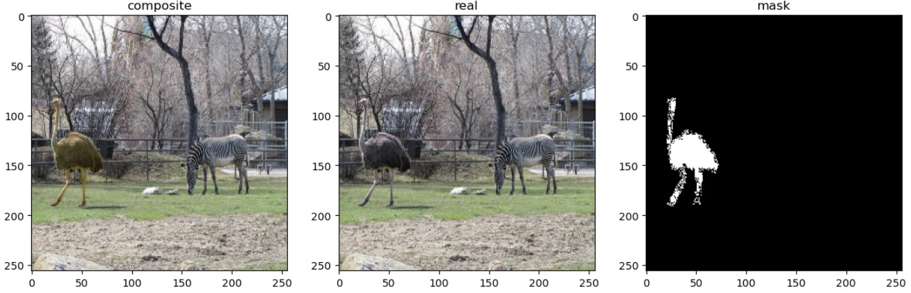
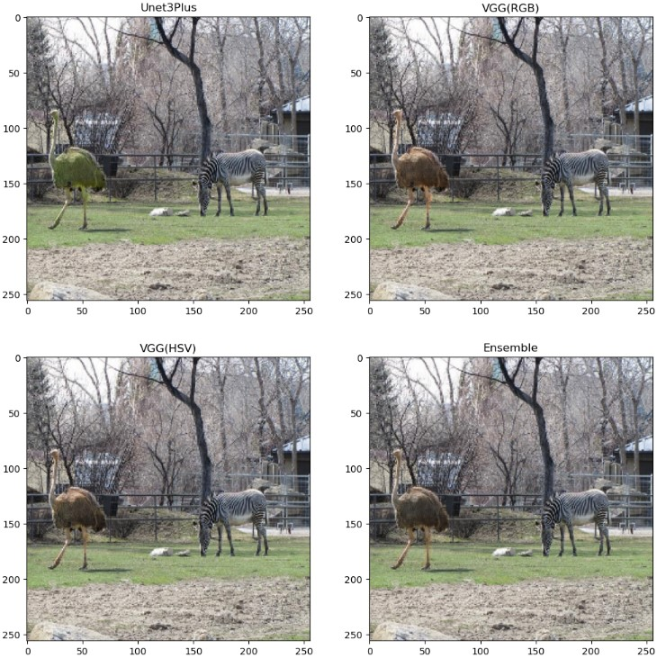
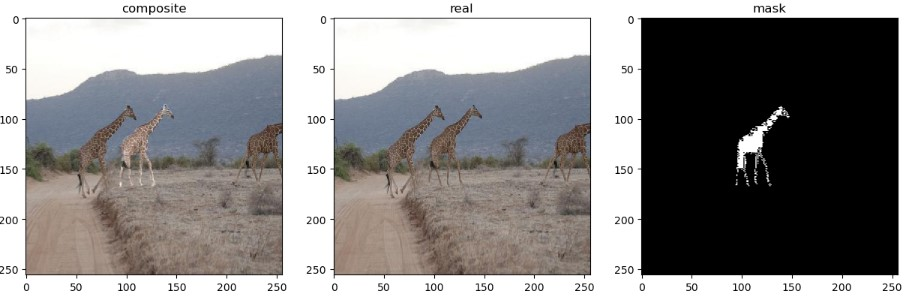
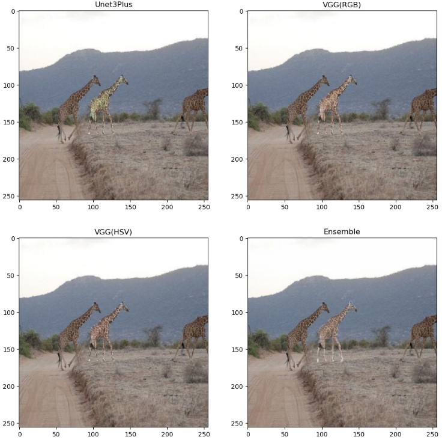

# Image-Harmonization
Image composition refers to cutting the foreground of an image and pasting it onto another background image to get a composite image. The foreground and background in a composite image are originally real, however, it looks like unreal after forming to a composite image, due to the inconsistency between the foreground and background. Image harmonization aims to solve the inconsistency between the foreground and background and make the composite image real again. In other ways, it is the process of transforming a composite image by adjusting its foreground appearances to be consistent with the background region to improve realism. In this project, we combine some ideas from previous research, following a general idea to use a GAN-type model with an attention enhanced U-net as a generator and formulate a compound loss function that involves the L1 loss for reconstruction along with one or more losses from the discriminator. This repository follows current state of the art techniques and introduces a novel method of using HSV representations to improve results.

## Dataset
The dataset used was the HCOCO dataset provided here - https://github.com/bcmi/Image-Harmonization-Dataset-iHarmony4. The HCOCO dataset is created from the MSCOCO dataset and the segmentation masks provided. The foreground image is transformed through color transfer methods to produce a composite image.

## Methods used
The idea is to use the attention enhanced U-net architecture and explore other alternatives to this generator and formulate a different compound loss function that involves the L1 loss for reconstruction and other losses. The initial color transfer methods that rely on color representations of the foreground and background image provide decent results when compared to other non-deep learning methods. These features are used to compute a loss function more representative of the problem at hand. A VGG is used with partial convolutions to extract feature maps from hue, saturation maps and comparing the respective feature maps to produce a loss function to be fed to the generator. A possible extension is to use an enhanced U-Net architecture such as the U-Net 3Plus to improve generator results. Also tried a gram matrix to find the differences between the input and target foregrounds as used in style transfer methods.

## Experiments
Evaluation is done on the benchmark dataset HCOCO, which contains around 42000 pairs of synthesized composite images and the ground-truth real images (38000 pairs for training and 4000 pairs for testing). In the experiments, the input images are resized to 256×256 during both training and testing phases. An Adam optimizer is used with learning rate 0.002. For comparison with state of the art in image harmonization task, two metrics are taken – namely the Mean Square Error, and the Peak Signal to Noise Ratio. These errors are calculated between the generated output from each model and the target real image. An ideal system has minimal mean square error and high peak to signal ratio. The first two rows shown below are conventional image-processing based methods, and as expected produce the highest errors. Dove-Net and Bargain-Net provide state of the art performances with the minimum error. The models in this project provide close to state-of-the-art results, with a little room for improvement in the mean square error sense.

| Methods	| MSE | PSNR |
| ------- | --- | ---- |
| Lalonde and Efros	| 110	| 31 |
| Xue |	77	| 32 |
| Dove-Net	| 35	| 36 |
| Bargain-Net	| 29	| 37 |
| Unet-3Plus Generator	| 79	| 32 |
| Unet + Style Encoder-RGB	| 60	| 34 |
| U-net + Style Encoder-HSV | 48	| 34 |

## Result Images

## Acknowledgements
A lot of this research relies heavily on research carried out by Cong et al. and their extensive repository on Image Harmonization - https://github.com/bcmi/Awesome-Image-Harmonization
